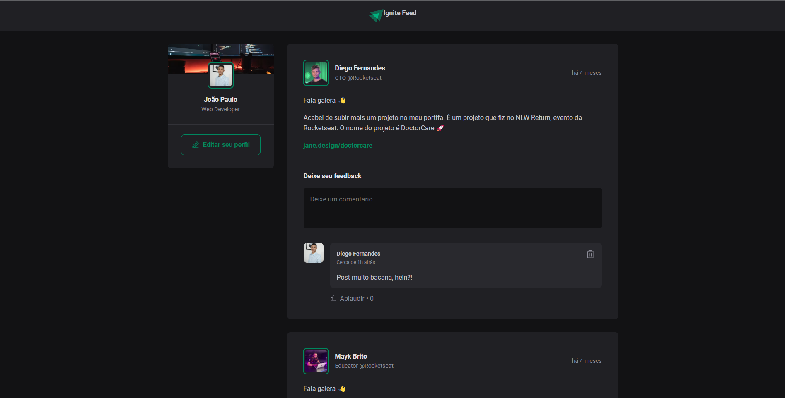

  Ignite feed

  <a href="#sobre">Sobre</a> &#xa0; | &#xa0;
  <a href="#tecnologias">Tecnologias</a> &#xa0; | &#xa0;
  <a href="#prints">Prints</a> &#xa0; &#xa0;

 

<h2 id="sobre">:dart: Sobre</h2>

Este projeto foi criado para praticar os fundamentos do ReactJS e aprender sobre os conceitos mais importantes, entre componentização, propriedades, estados, imutabilidade e hooks, além de aplicar o Typescript para adicionar tipagem estática à aplicação

<h2 id="tecnologias">:rocket: Tecnologias</h2>

As seguintes tecnologias foram utilizadas no projeto:

<h5>Frontend</h5>

- [React.js](https://pt-br.reactjs.org/)
- [Typescript](https://www.typescriptlang.org/)
- [Vitejs](https://vitejs.dev/)
- [Date-fns](https://date-fns.org/)

<h2 id="prints">:framed_picture: Print da Aplicação</h2>

<h1 align="center">
  
</h1>
